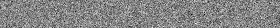
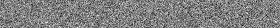
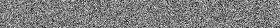
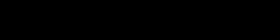

<div align="center">


# 🌐 Diffusion World 🌐

Welcome to **Diffusion World** !

This repository is a collection of diffusion models,
implemented in `PyTorch` and `PyTorch Lightning`.
</div>

## 🚀 Features
- **Models You Can Explore**:
  - [DDPM](https://arxiv.org/abs/2006.11239) (denoising diffusion probabilistic model)
  - [D3PM](https://arxiv.org/abs/2107.03006) (structured denoising diffusion model in discrete state-spaces)

- **Datasets Integrated**:
    - [MNIST](https://pytorch.org/vision/main/generated/torchvision.datasets.MNIST.html)
    - [CIFAR-10](https://pytorch.org/vision/main/generated/torchvision.datasets.CIFAR10.html)

## 🌟 Examples
- To train `DDPM` with `MNIST` dataset
```bash
python run.py --model=ddpm --dataset_name=mnist
```

- To train `D3PM` with `CIFAR-10` dataset
```bash
python run.py --model=d3pm --discrete=True --dataset_name=cifar10
```

After training, retrieve your models and results from the ./results directory.

- For additional command line arguments, use:
```bash
python run.py --help
```

## 📊 Training Results 
- **DDPM** with **cifar10** dataset
```bash
python run.py --model_name=ddpm --dataset_name=cifar10
```

<details open>
<summary>Click to collapse</summary>

epoch 1



epoch 5



epoch 10


</details>

- **D3PM** with **mnist** dataset
```bash
python run.py --model_name=d3pm --discrete=True --dataset_name=mnist --scheduler_mode=jsd
```

<details open>
<summary>click to collapse</summary>

epoch 1



epoch 5


epoch 10


</details>

## TODO
<details>
<summary>Click to expand</summary>

- [ ] Add a diffusion model of `Noise Conditional Score Network`(https://arxiv.org/abs/1907.05600)

- [ ] Add DDIM sampling method
</details>

## References
Thanks to the following repositories and papers for the inspiration and guidance:
- [Denoising Diffusion Probabilistic Models](https://arxiv.org/abs/2006.11239)
- [Structured Denoising Diffusion Models in Discrete State-Spaces](https://arxiv.org/abs/2107.03006)
- [lucidrains/denoising-diffusion-pytorch](https://github.com/lucidrains/denoising-diffusion-pytorch)
- [google-research/d3pm](https://github.com/google-research/google-research/blob/master/d3pm/images/diffusion_categorical.py)
- [cloneofsimo/d3pm](https://github.com/cloneofsimo/d3pm)

